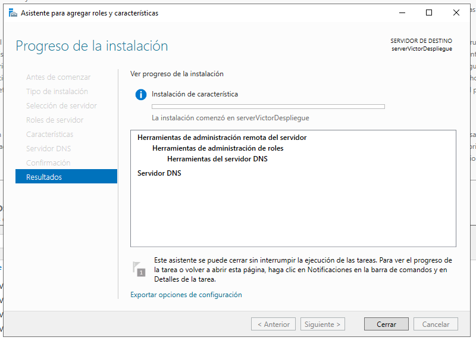
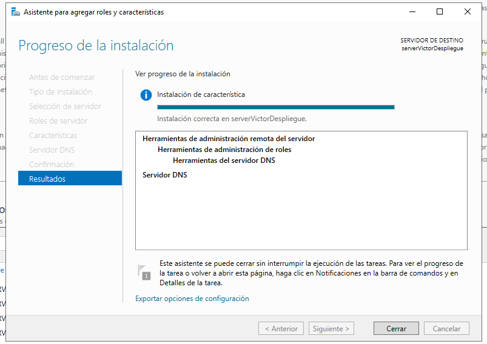
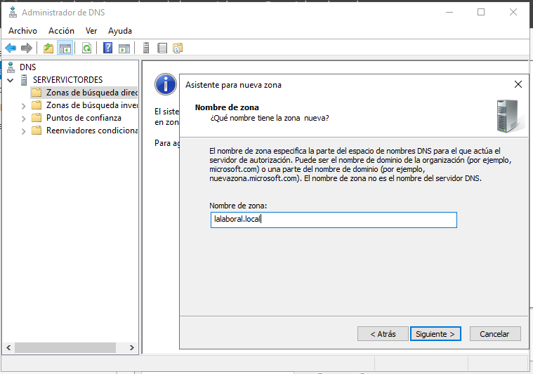
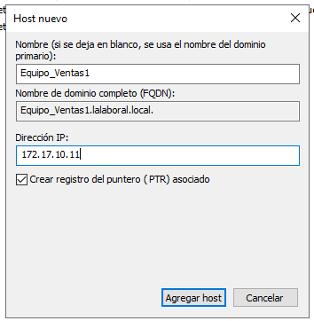
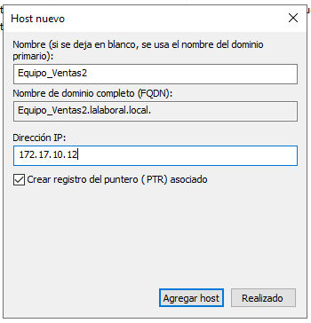
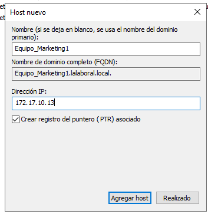
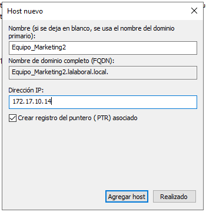
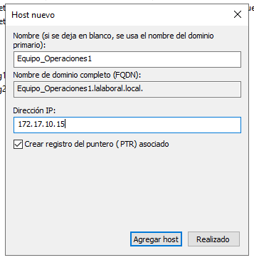
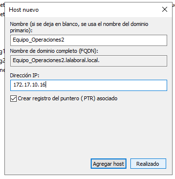

# Configuración del servicio DNS

1. #### Objetivo:
  Configurar un servicio DNS en Windows Server 2019 o en un servidor Ubuntu con Docker,
  para el dominio ` lalaboral.local` y asignar direcciones IP a los equipos dentro del dominio.

  Los equipos dentro del dominio ` lalaboral.local` podrán resolver nombres de host y
  direccionamiento IP utilizando el servidor DNS configurado. 

  

  ##### a. Instalación del Servicio DNS 

  *Cambiamos la ip del servidor*

  *Cambiamos el nombre del equipo*

​	*Agregamos el Servidor DNS*

​	*Instalación en progreso*

​	*Terminada con éxito*

##### 	b. Configuración de Zonas y Registros DNS		

​	

​	*Creamos la zona de búsqueda directa llamada `lalaboral.local`*

​	*Zonas creadas*

- Agregar registros A para los equipos creados en el ejercicio anterior, incluyendo el servidor:

  - server.lalaboral.local -> 172.17.10.10

  - Equipo_Ventas1.lalaboral.local -> 172.17.10.11

    

  - Equipo_Ventas2.lalaboral.local -> 172.17.10.12

    

  - Equipo_Marketing1.lalaboral.local -> 172.17.10.13

    

  - Equipo_Marketing2.lalaboral.local -> 172.17.10.14

    

  - Equipo_Operaciones1.lalaboral.local -> 172.17.10.15

    

  - Equipo_Operaciones2.lalaboral.local -> 172.17.10.16

    

- c. Configuración de Zona Inversa:

 

  - Agregar registros PTR para asociar las direcciones IP con los nombres de host correspondientes.

 

*VERIFICACIÓN*

*Ponemos la direccion ip dentro del rango 172.17.10.0 y el dns del server*

*Configuramos el archivo /etc/resolv.conf*

*VERIFICACION CORRECTA*

